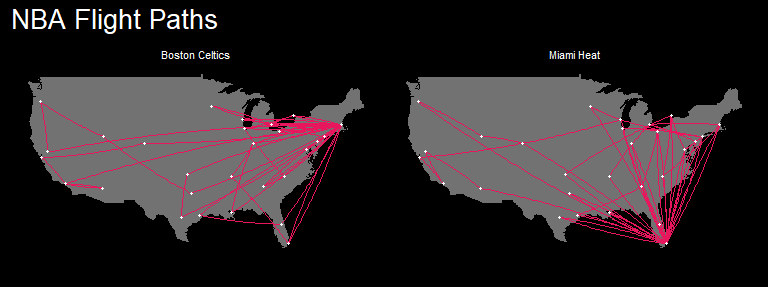
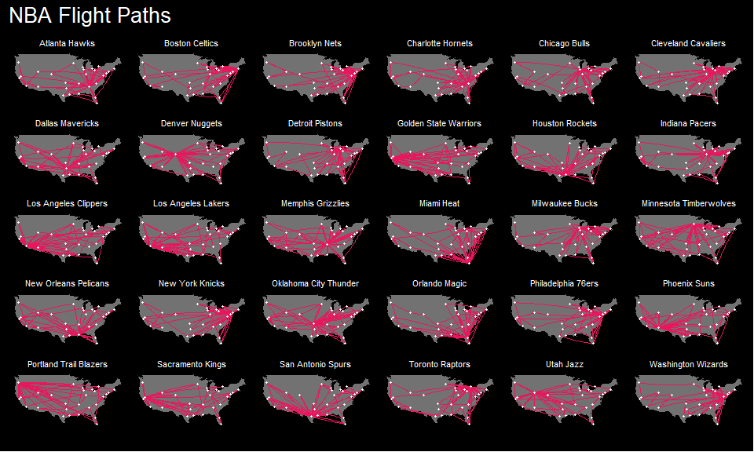

 <!-- badges: start -->
  [](https://opensource.org/licenses/MIT)
  [](https://www.tidyverse.org/lifecycle/#experimental)
  <!-- badges: end -->

# {airball}
An R package to extract common NBA schedule & travel metrics for modeling purposes.


***

## 1) Intro

The impact of schedule density and fixture congestion on team performance and injury risk is frequently discussed in various different sports and leagues around the world. **{airball}** provides a set of functions to quickly compute common schedule and travel related metrics from publicly available resources, both at a team and individual player level.

The motivation behind this package is to provide practitioners wishing to model schedule and travel data with tools to facilitate the extraction of several common metrics such as distance traveled, time zone changes, flight duration, routes, number of rest days, location coordinates, etc.  

Currently, **{airball}** queries only past games. Meaning users can only request previous seasons or games that were already played during the current season.

The package is currently under development and only provides information for NBA teams. The goal is to expand to other leagues and sports over time.

## 2) Installation

```{r}
#Install from CRAN 
#Currently underdevelopment and not on CRAN

  
#Install the development version from GitHub  
install.packages("devtools")
devtools::install_github("josedv82/airball")
```

## 3) Usage

### To extract metrics for NBA teams and players:

There are currently two functions to help extract travel and schedule related metrics for NBA teams and players. 

* `nba_travel()`
* `nba_player_travel()`

Before explaining those two functions, I'd like to credit Alex Bresler and his package [**{nbastatR}**](https://github.com/abresler/nbastatR) as I have embedded one of the functions he wrote [`game_logs()`](https://rdrr.io/github/abresler/nbastatR/man/game_logs.html) within my code to query NBA schedule data from the [NBA Stats](https://www.nba.com/stats/players/boxscores/) website.

### 4) Team Metrics:

To get travel and schedule metrics:

```
nba_travel(season = 2017,
           team = c("Los Angeles Lakers", "Boston Celtics"),
           return_home = 3,
           phase = "RS",
           flight_speed = 550)
```

The `nba_travel()` function accepts 5 arguments:

* **season**: A number or a vector of seasons for multiple seasons. For example `2002` or `c(2005:2008)`. If not set it defaults to 2018.
* **team**: The name of the team to explore or a vector of teams for multiple teams. If not set it defaults to all teams in the selected season.
* **return_home**: A number. Users can add a return home trip if two consecutive away games are separated by 'x' number of days. This helps improve the total mileage accuracy.
* **phase**: The phase of the season to download. *RS* for regular season, *PO* for playoffs or *c("RS", "PO")* for both. It defaults to both if not set.
* **flight_speed**: Users can set an average flight speed. This parameter is used to calculate estimated flight duration. It defaults to 450 (mph) if not set.

It returns a data frame with multiple travel metrics including: 

* distance, 
* route, 
* rest days, 
* time zone, 
* time zone change (shift), 
* estimate flight duration, 
* direction of travel, 
* whether it is a return home flight 
* origin and destination city coordinates
* etc

### 5) Player Metrics:

To get travel and schedule metrics at a player level use:

```{r}

nba_player_travel(season = 2018,
                  return_home = 4,
                  team = "Cleveland Cavaliers",
                  player = "Jose Calderon")

```

It works like `nba_travel()` but it adds one more argument (player). Users can set it to one player, a vector of players or leave blank, in which case it defaults to all players in the selected query. 

It returns the same metrics as the previous function and adds individidual factors such as

* individual rest
* individual games played
* minutes played
* several common individual game stats (points, rebounds, assists, turn overs, etc).
  
  
`*The first season available for both of the above functions is 1947.*`


### 6) Flight Paths Plot

To plot the estimated flight paths for the selected season and team(s) use `nba_travel_plot()`. This function accepts the result of `nba_travel()` and returns a ggplot object that can be further customized by the user.

```{r}

#example with just 2 teams

datos <- nba_travel(season = 2015:2018)
nba_travel_plot(data = datos,
                season = 2017,
                team = c("Boston Celtics", "Miami Heat"),
                city_color = "white",
                plot_background_fill = "black",
                land_color = "gray",
                caption_color = "lightblue",
                ncolumns = 2)

```




```{r}

#example with all 30 teams

nba_travel_plot(data = datos,
                season = 2017,
                city_color = "white",
                plot_background_fill = "black",
                land_color = "gray",
                caption_color = "lightblue")


```



There are several common ggplot arguments users can customise to achieve the desired look as well as the ability to further work with the image outside of the function as it is just a ggplot object.

### 6.1) Interactive 3D Flight Plots

Although outside of the scope of this package, it is worth mentioning that users can combine the results of `nba_travel()` with the plotting capabilities of [{echarts4r}](https://echarts4r.john-coene.com/) to create dynamic 3D plots of the flight paths with just a few lines of code. 

Below is an example of how to do this:

```
library(echarts4r)
library(echarts4r.assets)
library(airball)
library(tidyverse)


data <- nba_travel(season = 2019, team = "Boston Celtics")

data %>% 
  filter(Route != "No Travel") %>%
  
  e_charts() %>% 
  e_globe(
    environment = ea_asset("starfield"),
    base_texture = ea_asset("world"), 
    height_texture = ea_asset("world"),
    displacementScale = 0.05
  ) %>% 
  e_lines_3d(
    Longitude, 
    Latitude, 
    d.Longitude, 
    d.Latitude,
    name = "flights",
    effect = list(show = TRUE)
  ) %>% 
  e_legend(FALSE)

```


### 7) Arbitrary Density Indicators

The last function currently implemented is `nba_density()`. This function accepts the result of `nba_travel()` and returns a data frame with various common arbitrary game density descriptors.

```{r}
datos <- nba_travel()
nba_density(df = datos)
```

It works at a team level and besides season, phase, date, team, location and 'W/L' it returns the following columns:

* **B2B**: Yes if the game is part of a back to back series.
* **B2B-1st**: Yes if the game is the first game of a back to back.
* **B2B-2nd**: Yes if the game is the second game of a back to back.
* **3in4**: Yes if the game is the 3rd game played in four days.
* **4in5**: Yes if the game is the 4th game played in five days.
* **5in7**: Yes if the game is the 5th game played in seven days.


## 8) Future Development

**{airball}** is currently under development and it may change over time.

## 9) Acknowledgment

As mentioned above, I'd like to thank Alex Bresler and his package [{nbastatR}](https://github.com/abresler/nbastatR) which I have used to query NBA schedule and box scores from the NBA stats website. 

I have also used his package previously [here](https://josedv.shinyapps.io/NBASchedule/) to create an app to visualize and manipulate several NBA game density factors.

## 10) Disclaimer

Please be aware the metrics and calculations in this package are estimations and might not accurately represent actual travel management plans by teams.
