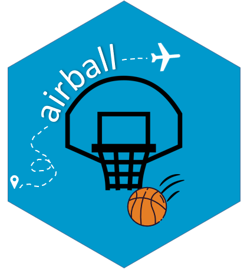

 <!-- badges: start -->
  [](https://www.tidyverse.org/lifecycle/#experimental)
  <!-- badges: end -->

# {airball}
An R package to calculate common schedule & travel metrics for NBA teams.



***

## Intro

The impact of schedule density and fixture congestion on team performance and injury risk is frequently discussed in various different sports and leagues around the world. **{airball}** provides a set of functions to quickly compute common schedule and travel related metrics from publicly available resources, both at a team and individual player level.

The motivation behind this package is to provide practitioners wishing to model schedule and travel data with tools to facilitate the extraction of several common metrics such as distance traveled, time zone changes, flight duration, routes, number rest days, location coordinates, etc.

**{airball}** is currently under development and only provides information for NBA teams. The goal is to expand to other leagues and sports over time.

## Installation

```
#Install from CRAN 
#Currently underdevelopment and not on CRAN

  
#Install the development version from GitHub  
install.packages("devtools")
devtools::install_github("josedv82/airball")
```

**under development...more info soon
